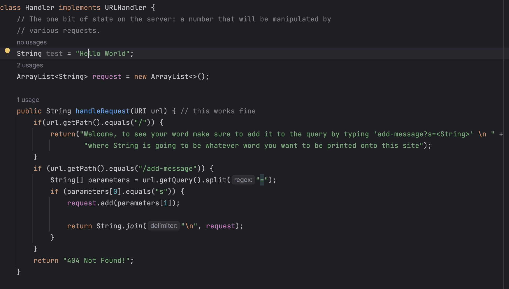
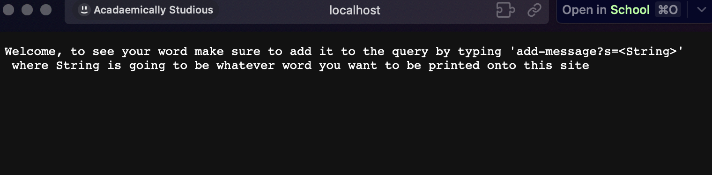
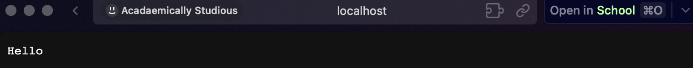
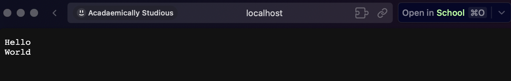

# Lab Report 2

## Part 1: String Server


This is the firs portion of the code, I found it easier to add an Array List that contians the words in the query because there is no set array length for words in the query which make this a lot easier


Accessing the server with no queries given


With one Query


With Two Queries


The methods that are mainly being used here is this only method that is shown here, because of the if statements, it can easily respond the requests that are being sent to the server. 

Within this method the only main argument here that is heavily uses is the URL of the server, because majority of the requests of the server are due to the URL link and changing it. The URL is what determines the use of the Array List and return the statement 

I would also add that the array List we created is the only relevant field in this class that affects majority of the server

The only way the Array List field is changed is by adding a new item into the list with every query that is sent, because of this, the website updates showing every single string element that is contained in the array list.

## Part 2 


One of the bugs I found that caught my eye was within the ArrayExamples class

The bug is a failure-inducing input is any non-empty list

Here is the buggy code:

``` 
@Test
public void testReverse2() { 
    int[] input = {1,2,3,4,5};
    int[] output = Array.Examples.reversed(input);
    assertArrayEquals(new int[]{5,4,3,2,1}, output);
} 
```

An input that doesn't induce a failure  would be an empty list, Which is shown here:

```
@Test 
public void testReverse() { 
    int[] input1 = {};
    assertArrayEquals(new int[]{5,4,3,2,1}, output)
} 
```

Here is the buggy code 

``` 
static int[] reverse(int[] arr) { 
    int newArray = new int[arr.length];
    for (int i = 0; i < arr.length; i+=1) { 
        arr[i] = newArray[arr.length - i - 1];
    }
    return newArray;
}

```
The way you would fix this code would be ti simply just swap arr[i] with newArray since arr[i] is the index we are looping over and newArray is the empty array we created that we need to fill in with our inputted array
Which is shown here: 

```
static int[] reversed(int[] arr) { 
    int[] newArray = new int[arr.length];
    for (int i = 0; i  arr.length) { 
        newArray[i] = arr[arr.length - i - 1];
    }
    return newArray;
}
```

With this small change in the code, it would actually help the code fully run and give us the results we need. Small and minor bug but it did have a huge impact on the program.

## Part 3


One of the biggest things I learned from lab in week 2 was understanding how testing works well and also understanding how a java server could be initiated and created. Creating a website was always something I was curious about and within lab 2 I was able to learn and see how to do, so in the future I can refer back to the lab to see if I would ver be stuck and need help with it. Very cool


