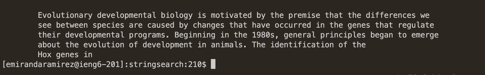
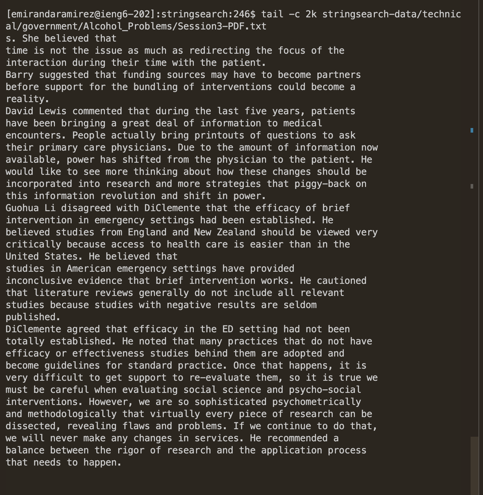

# LAB Report 3

Out of all the 3 different command given, I found the **less** command one of the more interesting ones to look up and research on

Within my research I was able to find 4 other alternates of the command **less** Which are shown here

- More 
- Head 
- Tail
- nl

---

## Alternate ways to use Less without using the command Less

## More

You might be wondering, what does the keywords More do? Well like less it does output the text within a file, but in a different way. Such as by pressing a certain keybind the text will scroll a certain percentage or backwards. It will always print out the whole text within a file but through a progressive way.

Example 1:
Here is how you can call it on one of the files in the technical directory:
```
more stringsearch-data/technical/911report/chapter-1.txt
```


As we can see we can see only a small portion of the larger text, if we press f, it allows us to go forward a small percentage this is shown below, also if you press s or d, you can go forward a smaller percentage, th


If you press B on your keyboard you go backwards:


Example 2
Another interesting way you can use more is by being explicit with how many lines you want to go forwards in
```
    more -100 stringsearch-data/technical/911report/chapter-1.txt
```

Here I emphasized that I should move forward in the text ever 100 lines, which makes going through the text a lot faster since it skips every 100 lines


---
## Head

Head shows the beginning portion of a file

Example 3
Head is pretty interesting since what it does is it shows the top portion of text in the given file as such:
```
head stringsearch-data/technical/plos/journal/plos/journal.pbio.0030021.txt
```


Example 4
Something I also found very interesting was that you can show out the amount of bytes in a file as shown:
```
head -c 3k stringsearch-data/technical/plos/journal.pbio.0030021.txt
```


these are the first 3 thousand bytes of the file which is pretty cool to see that all of these text create up to 3k bytes 

---
## Tail

Tail is similar to head where instead of showing the beginning portion of the file, it shows the last portion of the file, hence the name.

Example 5: 
Here is how you would call it for a text file:
```
tail searchstring-data/technical/government/Alcohol_Problems/Session2-PDF.txt
```


Here the terminal is able to print out the last 7 lines of the 629 lines within the given text file in the government direcetory

Example 6:
Another way you can use the tail command is being as well select the certain amount of bytes we want a file to output such as
```
tail -c 2k stringsearch-data/technical/government/Alcohol_Problems/Session3-PDF.txt
```


As shown here it prints out the last 2k bytes of the given text file which is cool seeing that we can use it for both the beginning and end of the file. 

---
## nl 

nl is a simple command that allows you to print out the number lines in a text file, but there are interesting things you can do with this basic command 

Example 7:
```
nl -s ..... stringsearch-data/technical/plos/journal.pbio.0030102.txt
```


Here within the amount of lines shown we can add a little seperator and what I did were little periods that extend onto it, you can insert any form of string and it will be placed in the seperator 

Example 8:
```
nl -i 100 stringsearch-data/technical/plos/journal.pbio.0030102.txt
```


Here we add an incrementor that increases the every line of text by 100 lines if we would ever create a new text file with this command we would create a long text file of text being shown ever 100 lines

---

These are some examples of alternate way to use the less command without using less itself, every example is pretty interesting and have their own unique trait towards them. 

---
links where I found the in

more usuage (https://www.geeksforgeeks.org/more-command-in-linux-with-examples/)


tail usuage (https://www.howtogeek.com/481766/how-to-use-the-tail-command-on-linux/)

head usage (https://linuxize.com/post/linux-head-command/)

nl usage (https://www.putorius.net/nl-command-basic-usage.html)
more nl (https://www.ibm.com/docs/en/aix/7.2?topic=n-nl-command)