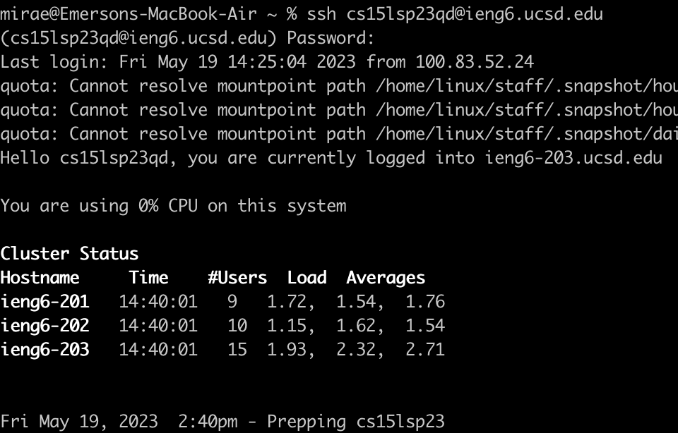
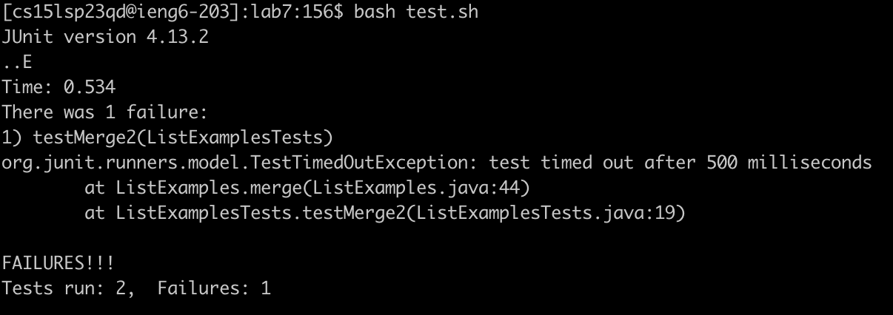
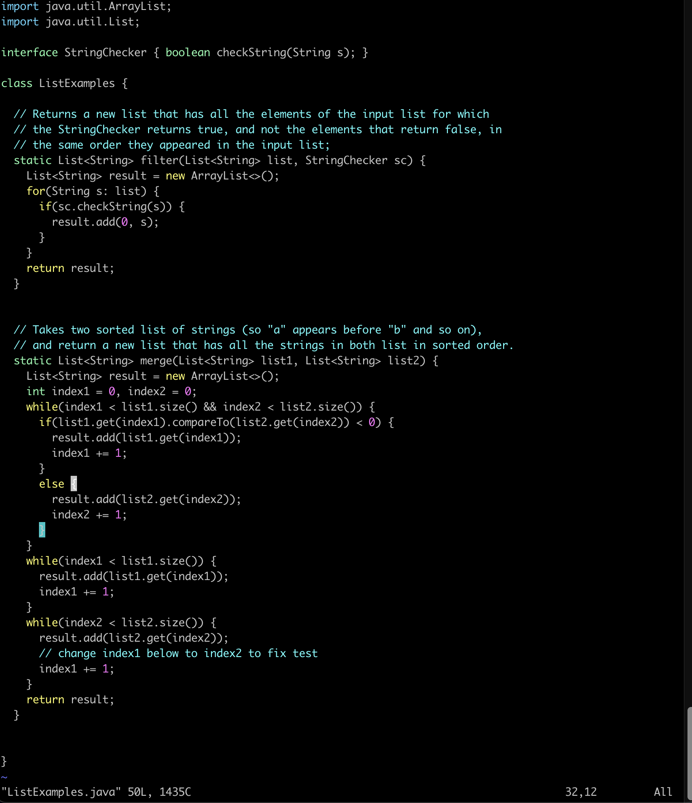
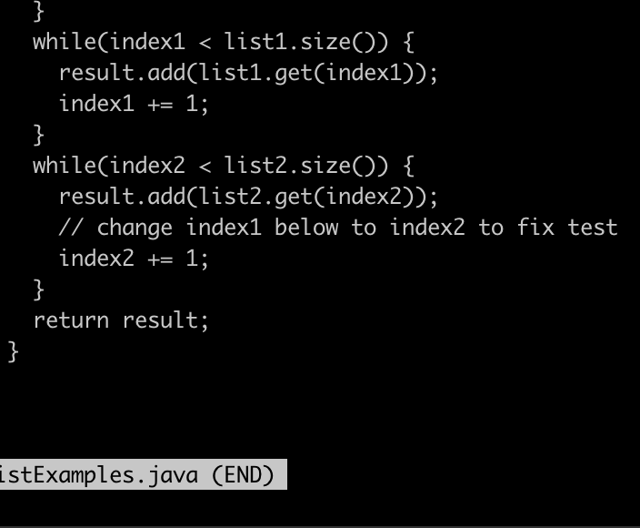
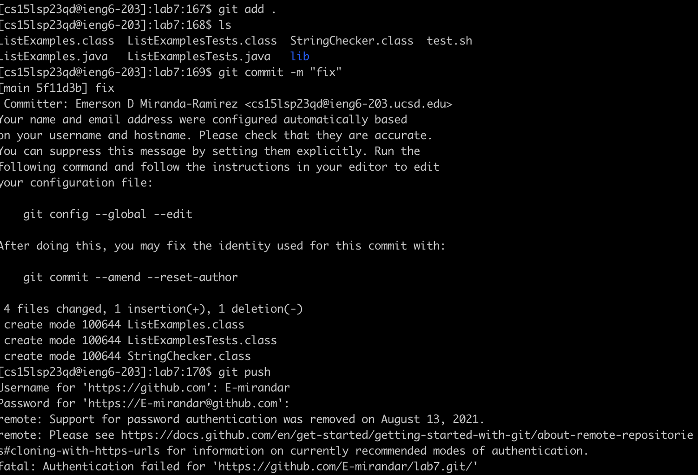

# Lab Report 4 

## We are doing the steps 4 - 9 from the lab 
---
# Step 4: 

So we first want to log into ssh and clone the new repository we have here

This time around I had to log in with my password since I havent been able to set up the ssh key yet

# Step 5 
 
Now I began to create the repository into my ieng6 account, one of the fastest ways I found to clone it was through searching the command history using `<ctrl><r>` together which then I proceeded to type 'git' which then popped up the 'git clone' command along with the link of the repository in in order to easily be able to clone the repository 

I pressed `<Enter>` and it started doing its magic

After typing `ls` into the command line I was able to see that indeed lab 7 is there so now we have to change directories to get into the lab 7 directory itself by pressing `cd l<tab>` (the tab filled in lab7 fully for me so it was useful)

# Step 6

now checking to see the files in this directory by pressing `ls` we can see a bash script there, I had to check what was in the bash script by typing `less te<tab>`

I saw that it both compiles and runs the junit test which is convenient knowing we cna just call this script to run the tests

Press `Q` in order to return back

now lets run the tests to see if it works 
typing in `bash te<tab>`

The error message says that in the ListExamples file there is an error there, at line 44 meaning we have to go fix it.

# Step 7

I like vim, vim is pretty cool 

so we edit the file ListExamples file by accessing it in vim, we can do this by typing up `vim ListExamples.java` and we are in vim

before we do anything, we must enter INSERT mode in vim, we can do this by simply pressing `I`

Now We can trace where th e Ccrror is at line 44, so I can either press the  `<down>` key 44 times or hold it down (I decided holding it down would bee the easier solution)

The comment in the code says to change the index1 variable to index2 so proceed to do that

Make sure to exit INSERT mode by pressing `<Escape>` and once thats done, we can exit vim by saving the file first by pressing `<Shift><;><W>`. Once that is done we can exit by pressing `<Shift><;><Q>`

To make sure our changes are saved, we can always check by typing `less ListExamples.java`

Indeed it was saved, press 

# Step 8

Now lets try to run the test again, since we already used the bash script before, we can find it from our history by pressing `<ctrl><r><b>` which will autofill to `bash test.sh` when we press `<enter>`, We do so and here are the results 

The tests do indeed end up passing this time meaning we were able to fix our buggy code in the terminal itself

# Step 9

Our final step just needs us to commit the code to github

The first thing we must do is type `git add .<enter>` in order add all the changed files. Then type in `git commit -m "fix"<enter>` to commit the changes, and finally type `git push<enter>` to push the changes. But then it kept asking me for my Username and password, which I did but it did not allow me to push  the changes to the remote repository. That is the only issue that must be fixed here. Perhaps I didnt set it up correctly, but im not 100% sure
