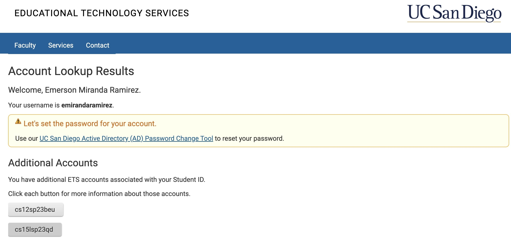
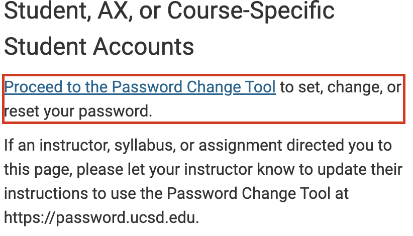
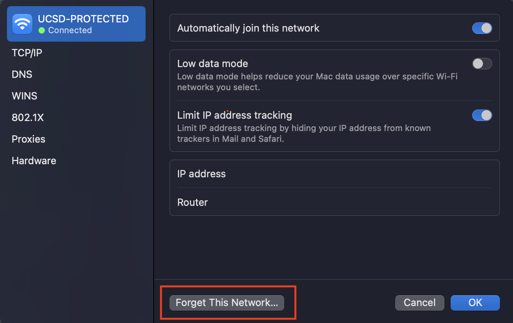
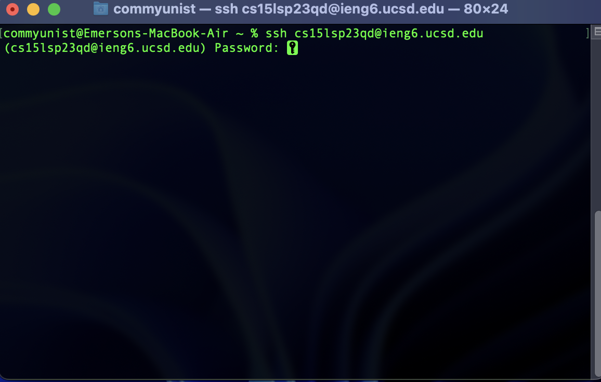

# Hello reader whomever you are and come from
---
## Welcome to where I will be teaching you how to remotely access your course specific account for whatever class you choose from!
___
you must make sure you have these necessities before we get started:

* **A computer** (We cannot do anything without a computer)
* **A terminal** (On macos we can open up the terminal, I think powershell would work for windows? Idk I'm not a windows user myself)
* **A good attitude** (you cant code while being grouchy)

With all of these things in mind, we Can begin on understaing how to access our school account from anywhere on UCSD campus

___

# Step 1: 

## Make sure you are able to access your your perfered account
  This is the only annoying part you are going to have to deal with
  
  TO even access are desired school acount, we must first find out which school account we want to use, we are able to do this by going to this Link"
  
  [https://sdacs.ucsd.edu/-icc/indet.php](https://sdacs.ucsd.edu/~icc/index.php)
  
  This Link will help us go to the site to access our accounts, but first we have to log in
  
  When you are able to log with the directions on screen you should be able to come to a site like this: 
  

Now that you are able to log in using your active directory, you can now click on your CSE 15l account or any other account that you please (make sure you copy the account name since this will be used for later)

___

# Step 2: 

## Restart the password of the account you chose

Within the site we have access, make sure you go your way to the "Global Password Change Tool

Proceed where it says "Proceed to the Password Change Tool

With the chosen name you selected, paste it In The AD Password Change tool where it says "Enter your username", this can be a class specific username like the cs15l one or your ucsd email account, which ever you please

After this you are able to change your password after authenticating with duo, and after that an email will be sent to your ucsd email to change the password for the account we have select, there is one more step when you are done resetting your password.

___

# Step 3

## Reconnceting to UCSD - Protected wifi for a smooth transition

This is something we are going to have to do after we reset the password to our account, all we do is disconnect from the "UCSD - PROTECTED" wifi, and relog in with our active directory password and such.

Make sure we select "Forget network", on mac it would look like this:

When thats done, give the account a good 15 - 20 minutes to finalize so the system gets your new password, remember patience is the key to this

---
# Step 4:

## Log into the school account using SSH

SSH is also known as "Secured Shell", which means when we are able to access a remote server from whereever we are, we can use SSH to access it since it is very secure. If we are tryng to access any ucsd account via ssh, we must make sure we are connected to the "UCSD - PROTECTED" Wifi as only this connection will allow us to connect to the reomte computer. 

Now open up any terminal in my case I will use the mac terminal, (if you are on windows you are going to have to install git,w whereas mac already has something like that built in, rip bozo)

Now with whatever terminal you chose make sure to type in "ssh <account name>@ieng6.ucsd.edu", as shown here

After it will ask for a password and thats where we put in the password we just reseted a while back. Put that password in here and we will have access to our remote computer just like that and we can use it for whatever our needs are 

---

# STEP 5 

## Test out that the remote access works by putting some basic command prompts on the terminal

Now that we are able to access our remote computer, lets make sure we are able to do things on it. For now we aren't skilled enough to tamper with anything too deep in it, so lets start by access the files it has by putting in some simple command prompts: 

*Command Prompt 1:*

  ls
